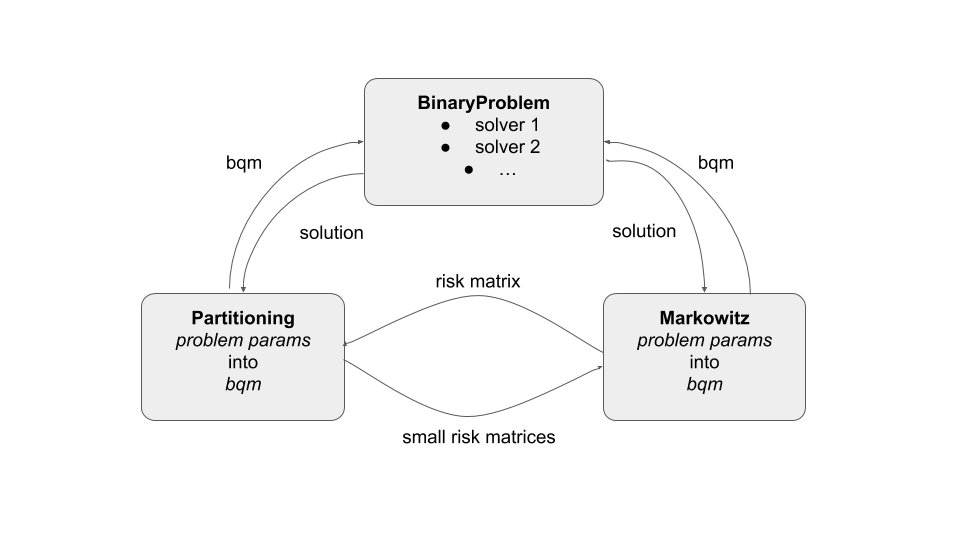

# Markowitz_partitioning

Following modules are used to build an alorithm to find solution to 
[markowitz portfolio optimization problem](https://www.researchgate.net/project/Financial-Portfolio-Management-using-D-Wave-Quantum-Computer-The-Case-of-Abu-Dhabi-Stock-Exchange)
via breaking it into smaller ones using [hierarchical risk parity](https://1qbit.com/whitepaper/quantum-inspired-hierarchical-risk-parity/) 
method. Both of these problems are formalized in terms of ising model that can be solved 
using following approaches:
* Bruteforce
* Trivial [genetic algorithm](https://pyeasyga.readthedocs.io/en/latest/)
* [D-wave](https://www.dwavesys.com/take-leap)
* [Simulated coherent ising machine (SimCIM)](https://www.osapublishing.org/oe/abstract.cfm?uri=oe-27-7-10288)
* Kerberos module from [D-wave hybrid](https://docs.ocean.dwavesys.com/projects/hybrid/en/latest/) 
with option to use SimCIM for subproblems instead of D-wave

Simplified version of algorithm building is following:

Class `BinaryProblem` includes methods - solvers to handle with problems of form 
BinaryQuadraticModel (BQM). Subclasses `Portfolio` and `Partitioning` 
solve portfolio optimization and matrix partitioning problems accordingly. 
`Portfolio` build it's BQM from risk matrix, average and prices. `Partitioning` for similar
purposes takes any square matrix (including risk matrix). Both use inherited method to solve 
their BQMs.  
For more details take a look into [examples](examples) files in general and [main example](examples/main_example.ipynb)
 particularly. Also don't hesitate to explore comments to [source code](modules).

